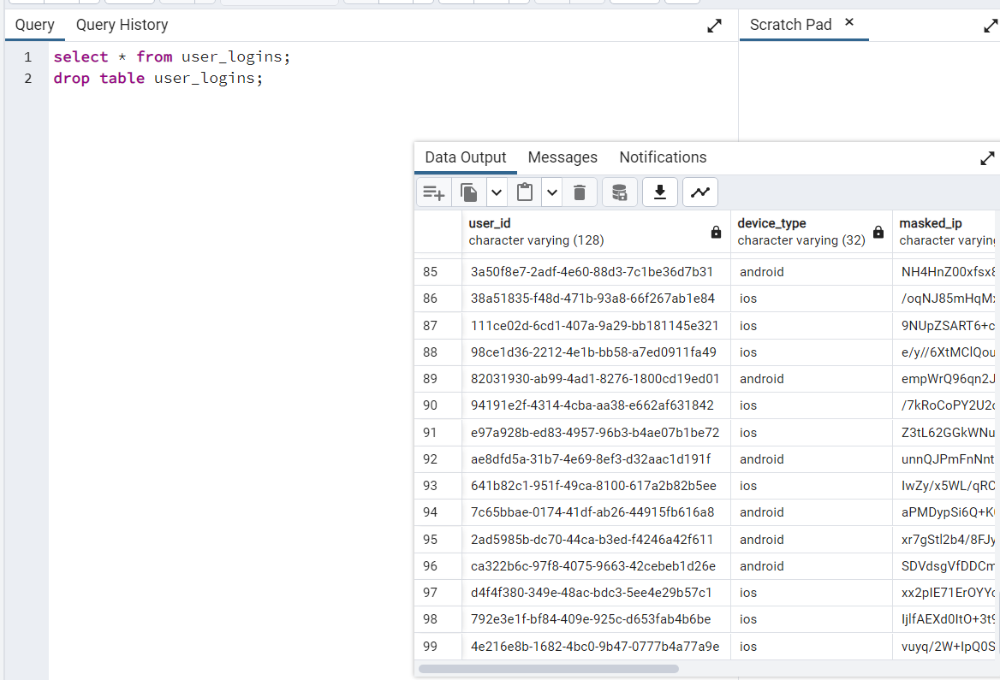

# ETL off an SQS Queue

### Author: [Yixuan(Lisa) Liang ](mailto:liangyixuan333@gmail.com)

## Overview

This application is designed to efficiently and securely process messages from an AWS SQS queue, transform the data, and then load it into a PostgreSQL database. It masks sensitive fields, ensuring the privacy of the data, and maintains a continuous polling mechanism until the queue is empty.

## Features

- Polls messages from a standard AWS SQS queue in batches of 10 messages per iteration.
- Extracts message body, parses JSON data, and loads into a dataframe.
- Masks IP and Device ID fields using SHA256 hashing.
- Stores the processed data in the `user_logins` table in PostgreSQL.
- Deletes processed messages from the queue.

## How to Run

### Pre-requisites:

- Docker
- PostgreSQL

### Execution Steps:

1. **Setup Dependencies**: Ensure `docker-compose` is installed.

   ```
   docker-compose --version
   ```

2. **Start Required Services**: Run LocalStack and PostgreSQL containers.

   ```
   docker-compose up 
   ```

3. **Read a message from the queue using awslocal**:

   ```
   awslocal sqs receive-message --queue-url http://localhost:4566/000000000000/login-queue
   ```
   Then will get the messages structure like below

   ```json
   {
    "Messages": [
        {
            "MessageId": "1a8c0722-fd55-49c0-9d63-b88d066c902d",
            "ReceiptHandle": "ZmZmNTNhYTctMDJjMS00YzQ0LTljZTAtYjdiODY2MGExMzM3IGFybjphd3M6c3FzOnVzLWVhc3QtMTowMDAwMDAwMDAwMDA6bG9naW4tcXVldWUgMWE4YzA3MjItZmQ1NS00OWMwLTlkNjMtYjg4ZDA2NmM5MDJkIDE2OTYyODc2ODAuMTE0NDAxNg==",
            "MD5OfBody": "e4f1de8c099c0acd7cb05ba9e790ac02",
            "Body": "{\"user_id\": \"424cdd21-063a-43a7-b91b-7ca1a833afae\", \"app_version\": \"2.3.0\", \"device_type\": \"android\", \"ip\": \"199.172.111.135\", \"locale\": \"RU\", \"device_id\": \"593-47-5928\"}"
        }
    ]
   }
   ```

   

4. **Verify Data**: Open PostgreSQL and check the `user_logins` table.

   ```shell
   psql -d postgres -U postgres -p 5432 -h localhost -W
   postgres=# select * from user_logins; 
   ```
   
5. **Download GitHub Files**: First,   download the application files from GitHub repository. 
   by visiting the following GitHub link: https://github.com/LIANGYIXUAN3335/ETL-off-an-SQS-Queue.

7. **Open a Command Line Interface**: We should open a command line interface (such as Terminal or Command Prompt) and navigate to the extracted application folder. This can be done using the cd command. For example:
   
   ```shell
   cd /path/to/ETL-off-an-SQS-Queue
   ```
   
8. **Run the Application**: Once inside the application folder, users can run the application entry command provided by you. 
   
   ```
   python -m src.main
   ```
   ```
   Result will be like this
   2023-10-04 12:19:49,780 - INFO - Received 1 messages to process.
   2023-10-04 12:19:49,781 - INFO - Starting to process message with ID: 1e73d036-a30a-4639-97f6-351a2d14b751.
   2023-10-04 12:19:49,781 - INFO - Processing message with ID: 1e73d036-a30a-4639-97f6-351a2d14b751
   2023-10-04 12:19:49,782 - INFO - Finished processing all messages.
   2023-10-04 12:19:49,782 - INFO - Messages processed and saved to database.
   2023-10-04 12:19:49,799 - INFO - Deleted message with ID: 1e73d036-a30a-4639-97f6-351a2d14b751 from SQS.
   2023-10-04 12:19:49,816 - INFO - Received 1 messages from SQS. Processing...
   2023-10-04 12:19:49,816 - INFO - Received 1 messages to process.
   2023-10-04 12:19:49,816 - INFO - Starting to process message with ID: 23d6fc95-5364-4d5b-a788-559e6fa6b1ff.
   2023-10-04 12:19:49,816 - INFO - Processing message with ID: 23d6fc95-5364-4d5b-a788-559e6fa6b1ff
   2023-10-04 12:19:49,817 - INFO - Finished processing all messages.
   ```
   
   
   
9. **Run the Application**

### Thoughts of design:
1. **Privacy First**: Given the sensitivity of IP and Device IDs, we employed SHA256 hashing to mask these fields. This ensures data privacy while maintaining the uniqueness and consistency of the data.
2. **Reliability**: Messages are deleted from the queue only after successful processing and storage in PostgreSQL, ensuring data integrity.
3. **Continuous Polling**: The system continuously pulls the queue until it's empty, ensuring all messages are processed.

### Assumptions Made:

- Device ID and IP fields are never null.
- Duplicates are allowed, assuming downstream data cleaning processes.
- Valid JSON structure in SQS messages.
- Pre-existing table schema in PostgreSQL.
- SHA256 as an acceptable masking technique.
- Properly configured unit tests.

### Potential Improvements:

- Integrate with Airflow for better pipeline orchestration.
- Use reversible hashing or token-based techniques for PII recovery.
- Consider NoSQL storage for JSON data.
- Implement rich data visualization using tools like matplotlib.

## Problems

1. **How would you deploy this application in production?**

   **Thought Process**: Our primary objectives are ensuring high availability, scalability, and security of the application.

   - Utilize **Kubernetes (k8s)** for deploying and orchestrating the Docker containers. Kubernetes provides capabilities such as auto-deployment, rolling updates, integrated storage systems, and service discovery. This ensures our application remains healthy, and auto-scales based on the load.
   - Sensitive information like database connection parameters, API keys, etc., should not be hardcoded or stored in plain text. We can consider using Kubernetes Secrets for storing such sensitive information, ensuring that only authorized pods have access.

2. **What other components would you want to add to make this production-ready?**

   **Thought Process**: An application in production should be stable, secure, and efficiently handle errors.

   - Integrate **AWS Lambda** with **SQS**. Whenever data is pulled from the SQS queue, Lambda can be triggered to process it. This serverless architecture can offer auto-scalability and reduce maintenance overhead.
   
3. **How can this application scale with a growing dataset?**

   **Thought Process**: As the data grows, we need to ensure that the system's response time doesn't degrade significantly while maintaining data consistency.

   - Leverage the Horizontal Pod Autoscaling (HPA) feature of **Kubernetes**. With this, if the CPU or memory utilization goes beyond a specified threshold, the number of Pods can be increased automatically to cater to more traffic.
   - Use **Amazon Kinesis** for stream processing of data. As the volume of data increases, Kinesis can offer real-time data stream processing, and in conjunction with Lambda, can ensure real-time processing of data.

4. **How can PII be recovered later on?**

   **Thought Process**: Even if we mask the data, there might be scenarios where we need the original data. Thus, we need a secure and reliable recovery mechanism.

   - A viable approach is to encrypt the data before masking, and store this encrypted data in a restricted storage area. When there's a need to recover the original data, only those with the appropriate decryption keys can decipher it.

5. **What are the assumptions you made?**

   - The input data always arrives in the expected format and structure.
   - The Kubernetes cluster is correctly configured, including network policies, storage, logging, and monitoring.
   - The database is always accessible, and any connection failures are transient and can be resolved with retry strategies.